# Compose Preview Screenshot Testing

A focused Android project demonstrating **Compose Preview Screenshot Testing** — a host-side, emulator-free screenshot testing approach for Jetpack Compose UIs using Android's official `com.android.compose.screenshot` Gradle plugin.

---

## What Is This?

Compose Preview Screenshot Testing renders `@Composable` functions through **Layoutlib** (the same engine Android Studio uses for the design preview pane) entirely on the JVM — no emulator, no device, no instrumentation harness required.

Each `@PreviewTest`-annotated function produces a reference PNG. On every subsequent run the rendered output is pixel-compared against that reference; any visual regression fails the build and generates an HTML diff report.

---

## Tech Stack

| Tool | Version |
|---|---|
| AGP | 8.9.1 |
| Kotlin | 2.1.21 |
| Compose BOM | 2024.10.00 |
| Screenshot plugin | 0.0.1-alpha13 |
| Gradle | 8.11.1 |
| Min SDK | 24 |
| Target / Compile SDK | 35 |

---

## Project Structure

```
app/
├── src/
│   ├── main/
│   │   └── kotlin/com/example/screenshottesting/
│   │       ├── MainActivity.kt
│   │       ├── components/
│   │       │   ├── ButtonComponent.kt    # PrimaryButton, SecondaryButton
│   │       │   ├── CardComponent.kt      # ContentCard (content + skeleton)
│   │       │   └── TopBarComponent.kt    # AppTopBar
│   │       └── ui/theme/
│   │           ├── Color.kt
│   │           ├── Theme.kt              # AppTheme — no dynamic color
│   │           └── Type.kt
│   ├── screenshotTest/
│   │   └── kotlin/com/example/screenshottesting/
│   │       └── PreviewScreenshots.kt     # 31 @PreviewTest functions
│   └── screenshotTestDebug/
│       └── reference/                    # Committed baseline PNGs (31 files)
```

---

## Reference Screenshots

All 31 reference images are committed to the repo and used as baselines for pixel comparison on every test run.

### PrimaryButton

<table>
  <tr>
    <td align="center"><b>Light</b></td>
    <td align="center"><b>Dark</b></td>
    <td align="center"><b>Disabled Light</b></td>
    <td align="center"><b>Disabled Dark</b></td>
  </tr>
  <tr>
    <td>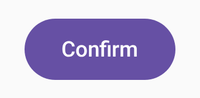</td>
    <td>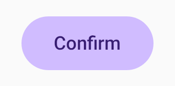</td>
    <td>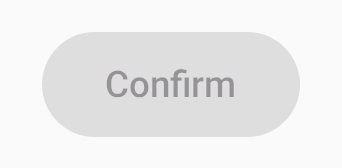</td>
    <td>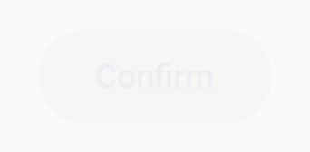</td>
  </tr>
  <tr>
    <td align="center"><b>With Icon Light</b></td>
    <td align="center"><b>With Icon Dark</b></td>
    <td align="center"><b>Large Font (1.5×)</b></td>
    <td align="center"><b>Huge Font (2.0×)</b></td>
  </tr>
  <tr>
    <td>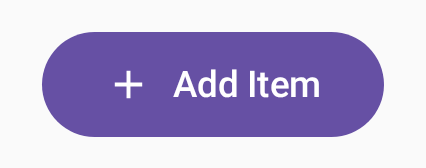</td>
    <td>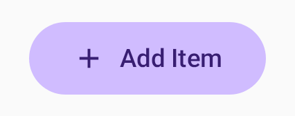</td>
    <td>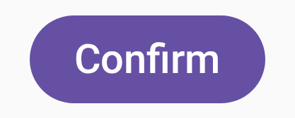</td>
    <td>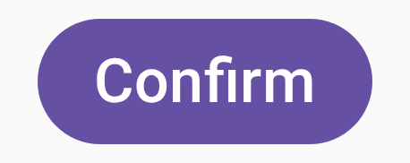</td>
  </tr>
  <tr>
    <td align="center"><b>Long Label</b></td>
    <td align="center"><b>Small Font (0.85×)</b></td>
    <td align="center"><b>RTL (Arabic)</b></td>
    <td align="center"><b></b></td>
  </tr>
  <tr>
    <td>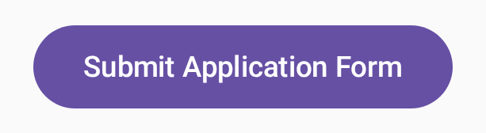</td>
    <td>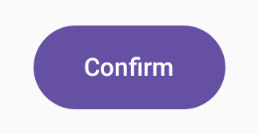</td>
    <td>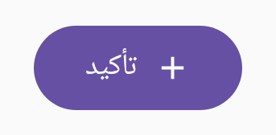</td>
    <td></td>
  </tr>
</table>

### SecondaryButton

<table>
  <tr>
    <td align="center"><b>Light</b></td>
    <td align="center"><b>Dark</b></td>
    <td align="center"><b>Large Font (1.5×)</b></td>
  </tr>
  <tr>
    <td>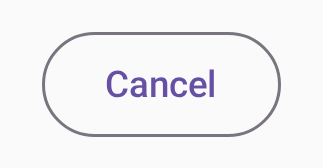</td>
    <td>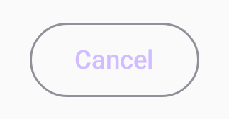</td>
    <td>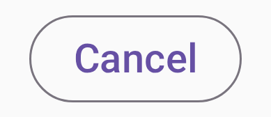</td>
  </tr>
</table>

### ContentCard

<table>
  <tr>
    <td align="center"><b>Light</b></td>
    <td align="center"><b>Dark</b></td>
    <td align="center"><b>Loading Light</b></td>
    <td align="center"><b>Loading Dark</b></td>
  </tr>
  <tr>
    <td>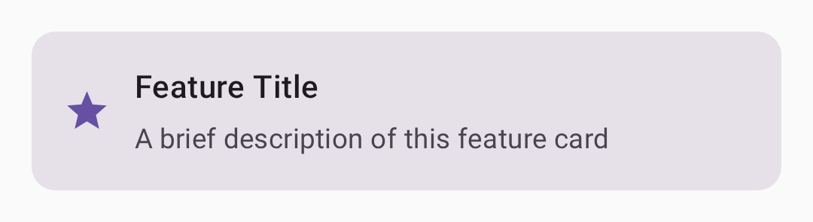</td>
    <td>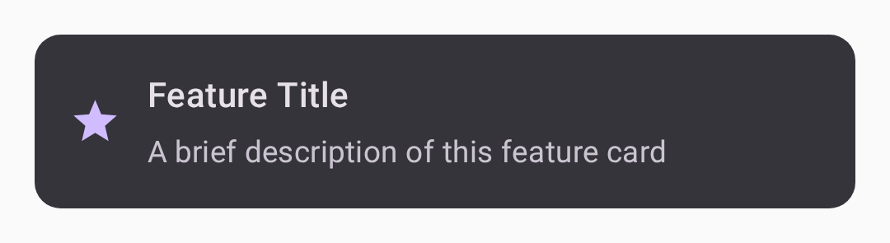</td>
    <td>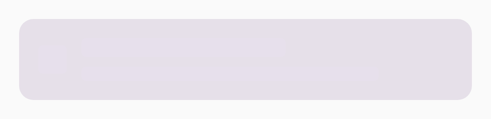</td>
    <td>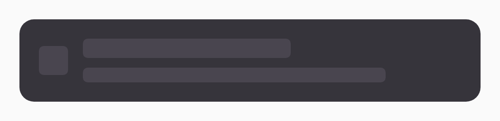</td>
  </tr>
  <tr>
    <td align="center"><b>No Icon</b></td>
    <td align="center"><b>Long Text</b></td>
    <td align="center"><b>Narrow (280dp)</b></td>
    <td align="center"><b>RTL (Arabic)</b></td>
  </tr>
  <tr>
    <td>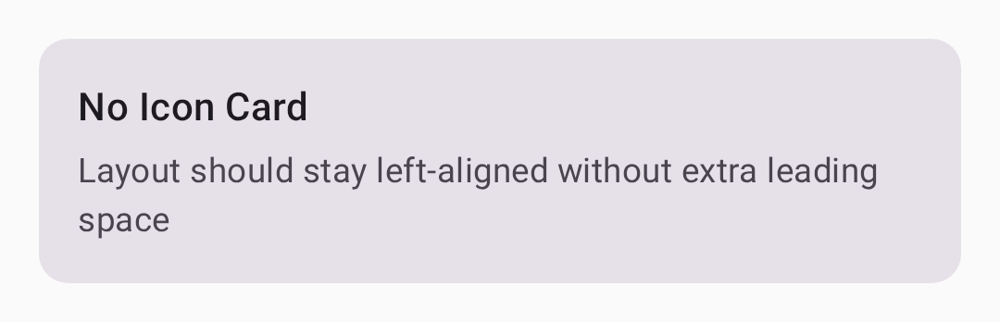</td>
    <td>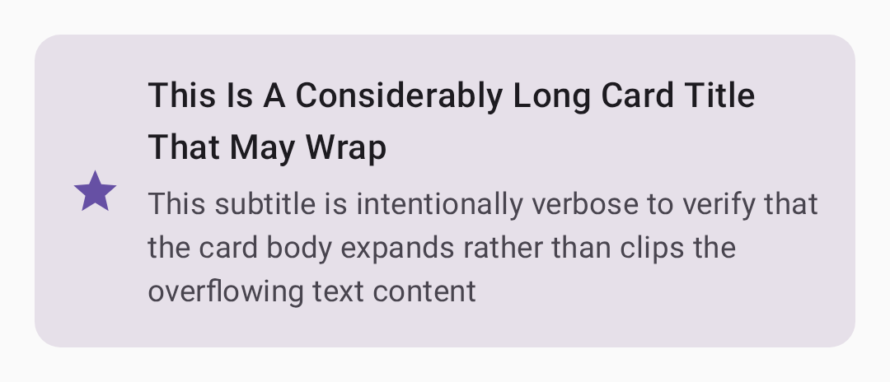</td>
    <td>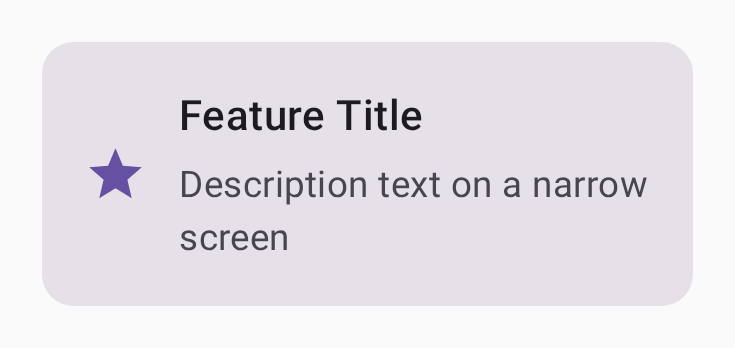</td>
    <td>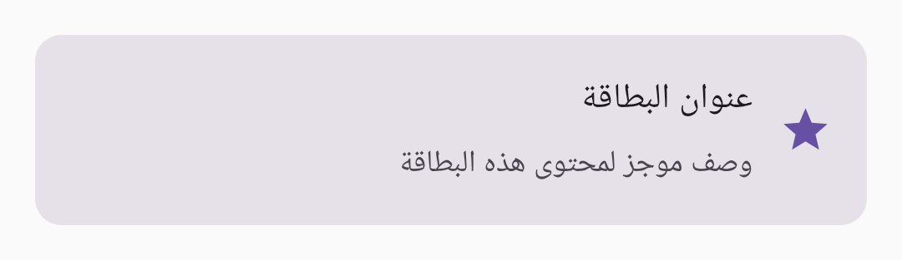</td>
  </tr>
  <tr>
    <td align="center"><b>Large Font (1.5×)</b></td>
    <td align="center"><b>Loading Large Font</b></td>
    <td align="center"><b></b></td>
    <td align="center"><b></b></td>
  </tr>
  <tr>
    <td>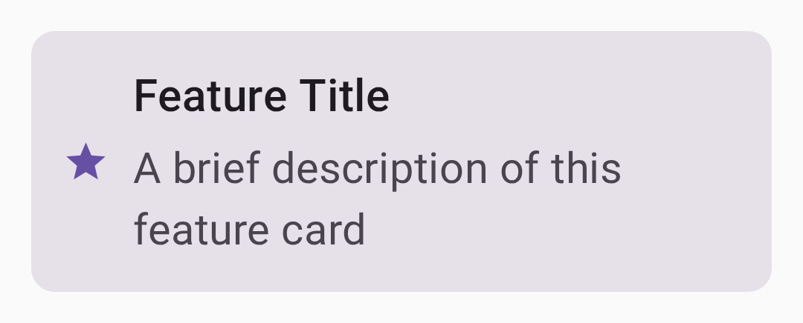</td>
    <td>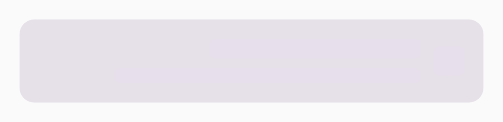</td>
    <td></td>
    <td></td>
  </tr>
</table>

### AppTopBar

<table>
  <tr>
    <td align="center"><b>Light</b></td>
    <td align="center"><b>Dark</b></td>
    <td align="center"><b>No Back Arrow</b></td>
    <td align="center"><b>Long Title</b></td>
  </tr>
  <tr>
    <td>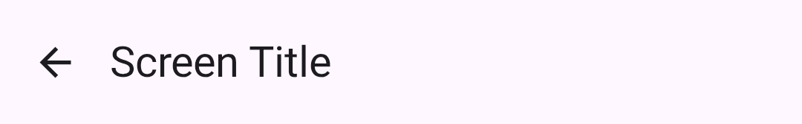</td>
    <td>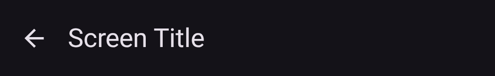</td>
    <td>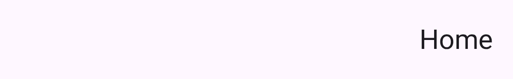</td>
    <td>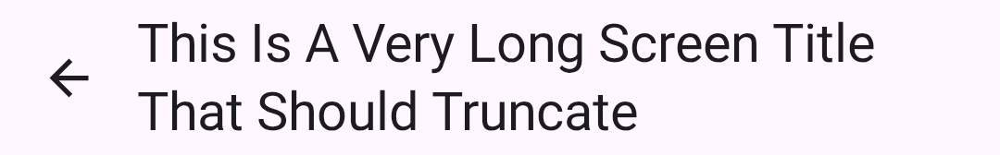</td>
  </tr>
  <tr>
    <td align="center"><b>Large Font (1.5×)</b></td>
    <td align="center"><b>Huge Font (2.0×)</b></td>
    <td align="center"><b>RTL (Arabic)</b></td>
    <td align="center"><b></b></td>
  </tr>
  <tr>
    <td>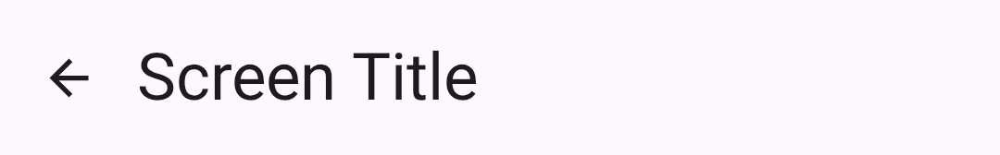</td>
    <td>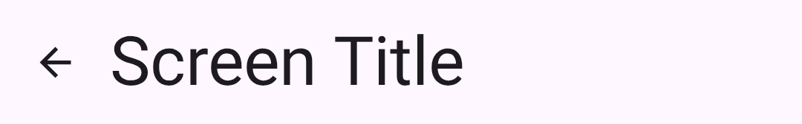</td>
    <td>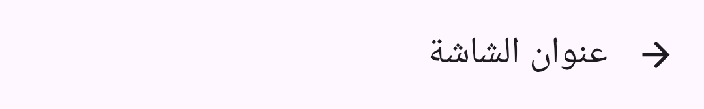</td>
    <td></td>
  </tr>
</table>

---

## Components Under Test

### PrimaryButton
Filled Material3 button with optional leading icon.

```kotlin
PrimaryButton(label = "Confirm", onClick = {})
PrimaryButton(label = "Add Item", onClick = {}, leadingIcon = Icons.Filled.Add)
PrimaryButton(label = "Confirm", onClick = {}, enabled = false)
```

### SecondaryButton
Outlined Material3 button for medium-emphasis actions.

```kotlin
SecondaryButton(label = "Cancel", onClick = {})
```

### ContentCard
Card with a leading icon, title, and subtitle. Supports a loading skeleton state using dp-sized placeholder boxes (font-scale invariant).

```kotlin
ContentCard(title = "Feature", subtitle = "Description", icon = Icons.Filled.Star)
ContentCard(title = "", subtitle = "", icon = null, isLoading = true)
```

### AppTopBar
Material3 `TopAppBar` with an optional back arrow. Uses `Icons.AutoMirrored.Filled.ArrowBack` so it auto-flips in RTL locales.

```kotlin
AppTopBar(title = "Screen Title", onNavigateBack = {})
AppTopBar(title = "Home", onNavigateBack = null)   // hides back arrow
```

---

## Test Coverage — 31 Tests

### ButtonPreviewScreenshots (13 tests)

| Test | What it covers |
|---|---|
| `ButtonPrimaryLightMode` | Filled button in light theme |
| `ButtonPrimaryDarkMode` | Filled button in dark theme |
| `ButtonSecondaryLightMode` | Outlined button in light theme |
| `ButtonSecondaryDarkMode` | Outlined button in dark theme |
| `ButtonPrimaryLargeFontScale` | Label reflow at 1.5× font scale |
| `ButtonPrimarySmallFontScale` | Compact layout at 0.85× font scale |
| `ButtonPrimaryDisabledLightMode` | Muted fill + text color when disabled (light) |
| `ButtonPrimaryDisabledDarkMode` | Muted color visible against dark surface |
| `ButtonPrimaryLongLabelLightMode` | No text clipping on long label |
| `ButtonSecondaryLargeFontScale` | Outlined stroke intact at 1.5× font scale |
| `ButtonPrimaryWithIconLightMode` | Icon + label alignment (light) |
| `ButtonPrimaryWithIconDarkMode` | Icon tint follows `onPrimary` in dark theme |
| `ButtonPrimaryHugeFontScale` | Label must not clip at 2.0× font scale |
| `ButtonPrimaryRtlLocale` | Arabic locale — text RTL, icon on visual leading side |

### CardPreviewScreenshots (10 tests)

| Test | What it covers |
|---|---|
| `CardContentLightMode` | Content card in light theme |
| `CardContentDarkMode` | Content card in dark theme |
| `CardLoadingLightMode` | Skeleton state in light theme |
| `CardLoadingDarkMode` | Skeleton state in dark theme |
| `CardContentLargeFontScale` | Text reflow at 1.5× font scale |
| `CardContentNoIconLightMode` | No orphaned spacer when icon is null |
| `CardContentLongTextLightMode` | Card expands vertically for long text |
| `CardLoadingLargeFontScale` | Skeleton boxes stay dp-sized at 1.5× font scale |
| `CardContentNarrowWidth` | Card fills 280dp canvas; text wraps |
| `CardContentRtlLocale` | Icon on right, text right-to-left in Arabic locale |

### TopBarPreviewScreenshots (8 tests)

| Test | What it covers |
|---|---|
| `TopBarLightMode` | Top bar in light theme |
| `TopBarDarkMode` | Top bar in dark theme |
| `TopBarLargeFontScale` | Title reflow at 1.5× font scale |
| `TopBarNoBackArrowLightMode` | Title shifts left; no empty icon slot |
| `TopBarLongTitleLightMode` | Long title truncates with ellipsis; arrow stays visible |
| `TopBarHugeFontScale` | Title at 2.0× must not overlap back arrow |
| `TopBarRtlLocale` | Back arrow flips right (→); title aligns right |

---

## Gradle Setup

### `gradle/libs.versions.toml`

```toml
[versions]
agp        = "8.9.1"
kotlin     = "2.1.21"
screenshot = "0.0.1-alpha13"

[libraries]
screenshot-validation-api = { group = "com.android.tools.screenshot", name = "screenshot-validation-api", version.ref = "screenshot" }

[plugins]
compose-screenshot = { id = "com.android.compose.screenshot", version.ref = "screenshot" }
```

### `gradle.properties`

```properties
android.experimental.enableScreenshotTest=true
```

### `app/build.gradle.kts`

```kotlin
plugins {
    alias(libs.plugins.android.application)
    alias(libs.plugins.kotlin.android)
    alias(libs.plugins.compose.screenshot)       // screenshot plugin
    alias(libs.plugins.kotlin.compose)
}

android {
    testOptions {
        screenshotTests {
            imageDifferenceThreshold = 0.0001f   // 0.01% pixel tolerance
        }
    }
    experimentalProperties["android.experimental.enableScreenshotTest"] = true
}

dependencies {
    screenshotTestImplementation(libs.screenshot.validation.api)
    screenshotTestImplementation(libs.compose.ui.tooling)
}
```

---

## Running the Tests

```bash
# Run all 31 screenshot tests
./gradlew validateDebugScreenshotTest

# Run a specific class
./gradlew validateDebugScreenshotTest --tests "*.ButtonPreviewScreenshots"

# Run a single test function
./gradlew validateDebugScreenshotTest --tests "*.ButtonPreviewScreenshots.ButtonPrimaryRtlLocale"

# Regenerate all reference images (after intentional UI changes)
./gradlew updateDebugScreenshotTest
```

---

## Test Report

### All 31 Tests Passing — 100% Successful

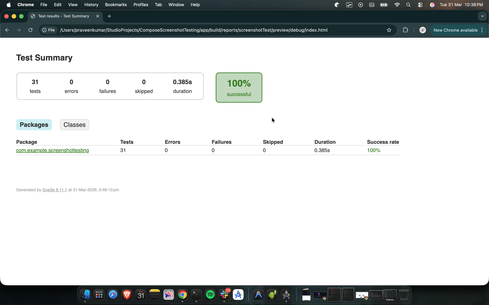

### Deliberate Regression — 14 Failures at 54%

Triggered by changing `PrimaryButton` padding from `16.dp` → `24.dp`. All 14 Button tests failed; Card and TopBar tests were unaffected.

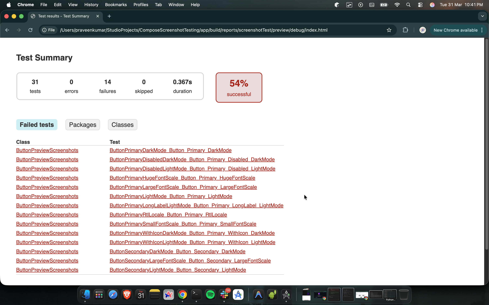

---

## HTML Report

After a run the report is available at:

```
app/build/reports/screenshotTest/preview/debug/index.html
```

Open it in any browser. For each failed test the report shows three tabs:

- **Reference** — the committed baseline PNG
- **Actual** — what was rendered this run
- **Diff** — pixel delta highlighted in pink

---

## How Reference Images Work

- Reference PNGs live in `app/src/screenshotTestDebug/reference/` and are **committed to git**.
- Filename format: `<FunctionName>_<PreviewName>_<hash>_0.png`
- **Never rename a `@PreviewTest` function** — renames orphan the reference PNG and the old baseline remains in git indefinitely.
- When a UI change is intentional, run `updateDebugScreenshotTest` and commit the updated PNGs alongside the code change.

---

## Key Design Decisions

### No Dynamic Color
`AppTheme` uses static `lightColorScheme` / `darkColorScheme` instead of `dynamicColorScheme`. Dynamic color reads the wallpaper palette at runtime — unavailable in Layoutlib — which would crash screenshot tests.

### Skeleton Uses `dp`, Not `sp`
`ContentCard`'s loading skeleton uses fixed `dp` sizes for placeholder boxes. The `CardLoadingLargeFontScale` test explicitly verifies this: skeleton dimensions must not scale with font size.

### `Icons.AutoMirrored` for RTL
`AppTopBar` uses `Icons.AutoMirrored.Filled.ArrowBack` so the back arrow automatically flips direction in RTL locales without any manual `layoutDirection` handling.

---

## Inspired By

Test patterns adapted from [Now in Android (NiA)](https://github.com/android/nowinandroid) — specifically:
- RTL locale testing (`locale = "ar"`)
- Huge font scale (`fontScale = 2.0f`)
- Narrow screen width (`widthDp = 280`)
- Leading icon button layout
- `topAppBar_hugeFont` test pattern
